# 🎬 MovieApp - React Movie App

[](https://reactjs.org/)
[](https://developer.mozilla.org/en-US/docs/Web/JavaScript)
[](https://www.themoviedb.org/documentation/api)
[](https://opensource.org/licenses/MIT)

> A modern, responsive React application for discovering popular movies with personalized favorites and secure authentication features(simulate).

> ### Live preview: https://movieapp-snowy-ten.vercel.app

## 📋 Table of Contents

- [Overview](#-overview)
- [Features](#-features)
- [System Architecture](#-system-architecture)
- [Tech Stack](#-tech-stack)
- [Installation](#-installation)
- [Configuration](#-configuration)
- [Usage](#-usage)
- [API Integration](#-api-integration)
- [Authentication](#-authentication)
- [404! Page Not Found](#-404-page-not-found)
- [Project Structure](#-project-structure)
- [Contributing](#-contributing)
- [License](#-license)

## 🌟 Overview

The MovieApp is a single-page application built with React that allows users to browse popular movies, manage their favorites, and experience secure authentication. The application integrates with The Movie Database (TMDB) API to provide up-to-date movie information and implements a robust client-side authentication system with protected routes.

### 🎯 Key Highlights

- **Modern React Architecture**: Built with React 19+ and functional components
- **Responsive Design**: Mobile-first approach ensuring optimal experience across all devices
- **Secure Authentication**: Demo authentication system with protected routes
- **Real-time Data**: Integration with TMDB API for latest movie information
- **Persistent Favorites**: Local storage implementation for user preferences
- **Professional UI/UX**: Clean, intuitive interface with smooth interactions

## ✨ Features

### 🎭 Core Features

- **Movie Discovery**: Browse popular movies with rich metadata
- **Grid Layout**: Responsive movie grid adapting to screen sizes
- **Favorites System**: Add/remove movies from personal favorites list
- **User Authentication**: Secure login simulation with session management
- **Protected Routes**: Route-level security preventing unauthorized access
- **Persistent Storage**: Favorites and user data stored locally

### 🛡️ Security Features

- **Route Protection**: Authentication guards for sensitive pages
- **Session Management**: Secure session handling and automatic redirects
- **Demo Authentication**: Safe login simulation for development/showcase

### 📱 User Experience

- **Responsive Design**: Seamless experience on desktop, tablet, and mobile
- **Fast Loading**: Optimized API calls and efficient state management
- **Intuitive Navigation**: Clear routing with breadcrumb-style navigation
- **Interactive UI**: Smooth animations and user feedback

## 🏗️ System Architecture

The application follows a modern layered architecture pattern:


### Architecture Layers

1. **Client Layer**: User interface components and routing logic
2. **API Integration Layer**: Service layer handling external API communications
3. **Storage Layer**: Data persistence and state management
4. **External Services**: Third-party integrations and content delivery

## 🛠️ Tech Stack

### Frontend Framework

- **React 19+**: Component-based UI library with hooks
- **React Router DOM**: Client-side routing and navigation
- **JSX**: JavaScript XML for component templating
- **ES6+ JavaScript**: Modern JavaScript features and syntax

### Styling & Design

- **CSS3**: Modern styling with Grid and Flexbox
- **Responsive Design**: Mobile-first responsive layouts
- **CSS Modules/Styled Components**: Component-scoped styling
- **Media Queries**: Adaptive layouts for different screen sizes

### API & Data Management

- **TMDB API v3**: The Movie Database REST API
- **Bearer Token Authentication**: Secure API authentication
- **JSON**: Data interchange format

### State Management & Storage

- **React Hooks**: useState, useEffect, useContext for state management
- **Context API**: Global state management
- **Local Storage**: Persistent client-side storage
- **Session Storage**: Temporary session-based storage

### Development Tools

- **Create React App/Vite**: Build toolchain and development server
- **NPM/Yarn**: Package management
- **Git**: Version control system
- **ES6 Modules**: Modern module system

## 🚀 Installation

### Prerequisites

- **Node.js** (v14.0.0 or higher) [used: v20.11.1]
- **npm** (v6.0.0 or higher) or **yarn** [used: 10.2.4]
- **TMDB API Key** (free registration at [TMDB](https://www.themoviedb.org/settings/api))

### Step-by-Step Setup

1. **Clone the repository**

   ```bash
   git clone [https://github.com/yourusername/movie-site-react.git](https://github.com/akaomarfahim/movie-site-react.git)
   cd movie-site-react
   ```

2. **Install dependencies**

   ```bash
   # Using npm
   npm install

   # Using yarn
   yarn install
   ```

3. **Environment configuration**

   ```bash
   # Create environment file
   touch .env

   # Add your TMDB API key
   echo "VITE_TMDB_API_KEY=your_api_key_here" >> .env
   echo "VITE_TMDB_BEARER=your_tmdb_bearer_token_here" >> .env
   ```

4. **Start development server**

   ```bash
   # Using npm
   npm start

   # Using yarn
   yarn start
   ```

5. **Open in browser**
   Navigate to `http://localhost:3000` [port number might varry, look into your terminal]

## ⚙️ Configuration

### Environment Variables

Create a `.env` file in the root directory:

```env
# TMDB API Configuration
VITE_APP_TMDB_API_KEY=your_tmdb_api_key_here
VITE_TMDB_BEARER=your_tmdb_bearer_token_here
VITE_TMDB_BASE_URL=https://api.themoviedb.org/3
VITE_TMDB_IMAGE_BASE_URL=https://image.tmdb.org/t/p/w500

# Development Configuration
REACT_APP_DEBUG_MODE=false
```

### API Configuration

The application uses TMDB API v3. Configure your API settings in `src/api/api-config.js`:

```javascript
export const API_CONFIG = {
  baseURL: import.meta.env.VITE_TMDB_BASE_URL,
  apiKey: import.meta.env.VITE_TMDB_API_KEY,
  bearer: import.meta.env.VITE_TMDB_BEARER,
  imageBaseURL: import.meta.env.VITE_TMDB_IMAGE_BASE_URL,
  endpoints: {
    popularMovies: (page) => `/movie/popular?page=${page || 1}`,
    movieDetails: (id) => `/movie/${id}?language=en-US`,
    searchMovies: (query) => `/search/movie?query=${encodeURIComponent(query)}`,
  },
  headers: {
    accept: "application/json",
    Authorization: `Bearer ${import.meta.env.VITE_TMDB_BEARER}`,
  },
};
```

## 📖 Usage

### Basic Navigation

1. **Home Page**: Browse popular movies in a responsive grid
2. **Movie Details**: Click on any movie to view detailed information
3. **Favorites**: Add movies to your personal favorites list
4. **Profile**: Access user profile (requires authentication)
5. **Login**: Login screen to authenticate user.

### Authentication Flow

```mermaid
sequenceDiagram
    participant User as 👤 User
    participant App as ⚛️ React App
    participant Auth as 🔐 Auth Service
    participant Storage as 💾 Session Storage

    User->>App: Access /profile
    App->>Auth: Check authentication
    Auth->>Storage: Verify session

    alt User not authenticated
        Storage-->>Auth: No valid session
        Auth-->>App: Redirect to login
        App-->>User: Show login page
        User->>App: Submit credentials
        App->>Auth: Validate credentials
        Auth->>Storage: Store session
        Auth-->>App: Authentication success
        App-->>User: Redirect to profile
    else User authenticated
        Storage-->>Auth: Valid session found
        Auth-->>App: Authentication verified
        App-->>User: Show profile page
    end
```



### Demo Login Credentials

For demonstration purposes, use these credentials:

```
Username: demo@movieapp.com
Password: demo123
```

### Favorites Management

- **Add to Favorites**: Click the heart icon on any movie card
- **Remove from Favorites**: Click the filled heart icon to remove
- **View Favorites**: Navigate to the favorites section
- **Persistence**: Favorites are stored in browser local storage

## 🔌 API Integration

### TMDB API Integration

The application integrates with The Movie Database (TMDB) API v3:

```javascript
// Example API service implementation
export const MovieService = {
  getPopularMovies: async (page = 1) => {
    const endpoint = API_CONFIG.endpoints.popularMovies();
    const data = await fetchFromTMDB(endpoint);
    return {
      popularMovies: data?.results || [],
      currentPage: data?.page || page,
      totalPages: data?.total_pages || 1,
    };
  },

  getMovieDetails: async (id) => {
    const endpoint = API_CONFIG.endpoints.movieDetails(id);
    return await fetchFromTMDB(endpoint);
  },

  getSearchedMovies: async (query) => {
    const endpoint = API_CONFIG.endpoints.searchMovies(query);
    const data = await fetchFromTMDB(endpoint);
    return data?.results || [];
  },

  getPosterPath: (movie) => {
    return movie.poster_path ? `${API_CONFIG.imageBaseURL}/${movie.poster_path}` : null;
  },
};
```

### API Endpoints Used

| Endpoint         | Method | Description          |
| ---------------- | ------ | -------------------- |
| `/movie/popular` | GET    | Fetch popular movies |
| `/movie/{id}`    | GET    | Get movie details    |
| `/search/movie`  | GET    | Search movies        |
| `/configuration` | GET    | API configuration    |

## 🔒 Authentication

### Demo Authentication System

The application implements a simulation authentication system for demonstration purposes:
Using Global-Context for user authentication.

```javascript
import { createContext, useContext, useState, useEffect } from "react";

/**
 * Authentication Context for managing user state
 */
const AuthContext = createContext();

export const useAuth = () => {
  const context = useContext(AuthContext);
  if (!context) {
    throw new Error("useAuth must be used within an AuthProvider");
  }
  return context;
};

// Demo user data for portfolio project
const DEMO_USERS = [
  {
    id: 1,
    email: "movie@movieapp.com",
    password: "password",
    name: "John Doe",
    avatar: "https://images.unsplash.com/photo-1472099645785-5658abf4ff4e?w=150&h=150&fit=crop&crop=face",
    bio: "Movie enthusiast and film critic. Love exploring different genres and discovering hidden gems.",
    joinDate: "2023-01-15",
    favoriteGenres: ["Action", "Sci-Fi", "Thriller"],
    watchedMovies: 247,
    reviews: 18,
  },
];

export const AuthProvider = ({ children }) => {
  const [user, setUser] = useState(null);
  const [loading, setLoading] = useState(true);

  // Check for existing session on mount
  useEffect(() => {
    const checkExistingSession = () => {
      try {
        const savedUser = localStorage.getItem("movieapp_user");
        if (savedUser) {
          const userData = JSON.parse(savedUser);
          setUser(userData);
        }
      } catch (error) {
        console.error("Error loading saved session:", error);
        localStorage.removeItem("movieapp_user");
      } finally {
        setLoading(false);
      }
    };

    checkExistingSession();
  }, []);

  const login = async (email, password) => {
    setLoading(true);

    // Simulate API call delay
    await new Promise((resolve) => setTimeout(resolve, 1000));

    try {
      // Find user in demo data
      const foundUser = DEMO_USERS.find(
        (u) => u.email.toLowerCase() === email.toLowerCase() && u.password === password
      );

      if (!foundUser) {
        throw new Error("Invalid email or password");
      }

      // Remove password from user object before storing
      const { password: _, ...userWithoutPassword } = foundUser;

      setUser(userWithoutPassword);
      localStorage.setItem("movieapp_user", JSON.stringify(userWithoutPassword));

      return { success: true };
    } catch (error) {
      return { success: false, error: error.message };
    } finally {
      setLoading(false);
    }
  };

  const logout = () => {
    setUser(null);
    localStorage.removeItem("movieapp_user");
  };

  const updateProfile = (updates) => {
    if (!user) return;

    const updatedUser = { ...user, ...updates };
    setUser(updatedUser);
    localStorage.setItem("movieapp_user", JSON.stringify(updatedUser));
  };

  const value = {
    user,
    login,
    logout,
    updateProfile,
    loading,
    isAuthenticated: !!user,
    demoUsers: DEMO_USERS.map(({ password, ...user }) => ({
      ...user,
      email: user.email,
    })), // Provide demo emails without passwords
  };

  return <AuthContext.Provider value={value}>{children}</AuthContext.Provider>;
};
```

### Protected Routes Implementation

ProtectedRoutes.jsx

```javascript
// Protected Route component
import { Navigate, useLocation } from "react-router-dom";
import { useAuth } from "../context/AuthContext";

function ProtectedRoutes({ children }) {
  const { isAuthenticated } = useAuth();
  const location = useLocation();

  // Redirect to login page with return url
  return isAuthenticated ? children : <Navigate to="/login" state={{ from: location }} replace />;
}

export default ProtectedRoutes;
```

**Usage in routing** - AppRoutes.jsx

```javascript
// Usage in routing
<Routes>
  <Route path="/" element={<Home />} />
  <Route path="/favorites" element={<FavoritesScreen />} />
  <Route path="/details/:id" element={<MovieDetailsScreen />} />
  <Route
    path="/profile"
    element={
      <ProtectedRoute>
        <ProfileScreen />
      </ProtectedRoute>
    }
  />
</Routes>
```

### Public Routes Implementation

PublicRoutes.jsx

```javascript
import { Navigate, useLocation } from "react-router-dom";
import { useAuth } from "../context/AuthContext";

function PublicRoutes({ children }) {
  const { isAuthenticated } = useAuth();
  const location = useLocation();

  return isAuthenticated ? <Navigate to="/profile" state={{ from: location }} replace /> : children;
}

export default PublicRoutes;
```

**Usage in routing** - AppRoutes.jsx

```javascript
<Routes>
  <Route path="/" element={<Home />} />
  <Route path="/favorites" element={<FavoritesScreen />} />
  <Route path="/details/:id" element={<MovieDetailsScreen />} />
  <Route
    path="/login"
    element={
      <PublicRoutes>
        <LoginScreen />
      </PublicRoutes>
    }
  />
</Routes>
```

## 🚫 404! Page Not Found

```javascript
<Routes>
  {/* Catch-all route for 404 */}
  <Route path="*" element={<NotFoundScreen />} />
</Routes>
```

## 📁 Project Structure

```
movie-site-react/
├── public/
├── src/
│   ├── api/
│   │   ├── api-config.js
│   │   ├── MovieServices.js
│   ├── assets/
│   │   ├── brand.png
│   │   ├── profile.svg
│   │   └── react.svg
│   ├── components/
│   │   ├── MovieCard.jsx
│   │   ├── MovieCardShimmer.jsx
│   │   └── NavBar.jsx
│   ├── context/
│   │   ├── AuthContext.jsx
│   │   ├── MovieContext.jsx
│   ├── styles/
│   │   ├── App.css
│   │   ├── Favorites.css
│   │   ├── Footer.css
│   │   ├── Home.css
│   │   ├── Index.css
│   │   ├── Login.css
│   │   ├── MovieCard.css
│   │   ├── MovieDetails.css
│   │   ├── Navbar.css
│   │   ├── Profile.css
│   ├── App.jsx
│   └── main.jsx
├── .env
├── .gitignore
├── eslint.config.js
├── index.html
├── package.json
├── README.md
└── vite.config.js
```

### Key Directories

- **`api/`**: API integration and business logic
- **`components/`**: Reusable React components organized by feature
- **`pages/`**: Top-level page components corresponding to routes
- **`routes/`**: Page routes for the application including public and protected routes
- **`utils/`**: Utility functions and constants
- **`config/`**: Application configuration files

## 🧪 Testing

### Running Tests - Future works

```bash
# Run all tests
npm test

# Run tests in watch mode
npm test -- --watch

# Run tests with coverage
npm test -- --coverage
```

### Test Structure

```
src/
├── __tests__/
│   ├── components/
│   ├── pages/
│   ├── services/
│   └── utils/
└── setupTests.js
```

## 📦 Building for Production

### Production Build

```bash
# Create production build
npm run build

# Serve production build locally
npm install -g serve
serve -s build
```

### Deployment Options

#### Netlify Deployment

1. Connect your GitHub repository
2. Set build command: `npm run build`
3. Set publish directory: `build`
4. Add environment variables in Netlify dashboard

#### Vercel Deployment

```bash
# Install Vercel CLI
npm install -g vercel

# Deploy
vercel --prod
```

#### Traditional Hosting

Upload the contents of the `build` folder to your web server.

## 🤝 Contributing

I welcome contributions to the Movie Discovery App! Please follow these guidelines:

### Development Workflow

1. **Fork the repository**
2. **Create a feature branch**
   ```bash
   git checkout -b feature/amazing-feature
   ```
3. **Make your changes**
4. **Add tests** for new functionality
5. **Commit your changes**
   ```bash
   git commit -m 'Add amazing feature'
   ```
6. **Push to the branch**
   ```bash
   git push origin feature/amazing-feature
   ```
7. **Open a Pull Request**

### Coding Standards

- Use Prettier for code formatting
- Write meaningful commit messages
- Add JSDoc comments for functions
- Maintain test coverage above 80%

### Pull Request Guidelines

- Provide clear description of changes
- Include screenshots for UI changes
- Ensure all tests pass
- Update documentation as needed
- Link to relevant issues

## 📄 License

This project is licensed under the MIT License - see the [LICENSE.md](LICENSE.md) file for details.

```
MIT License

Copyright (c) 2025 MovieApp

Permission is hereby granted, free of charge, to any person obtaining a copy
of this software and associated documentation files (the "Software"), to deal
in the Software without restriction, including without limitation the rights
to use, copy, modify, merge, publish, distribute, sublicense, and/or sell
copies of the Software, and to permit persons to whom the Software is
furnished to do so, subject to the following conditions:

The above copyright notice and this permission notice shall be included in all
copies or substantial portions of the Software.

THE SOFTWARE IS PROVIDED "AS IS", WITHOUT WARRANTY OF ANY KIND, EXPRESS OR
IMPLIED, INCLUDING BUT NOT LIMITED TO THE WARRANTIES OF MERCHANTABILITY,
FITNESS FOR A PARTICULAR PURPOSE AND NONINFRINGEMENT. IN NO EVENT SHALL THE
AUTHORS OR COPYRIGHT HOLDERS BE LIABLE FOR ANY CLAIM, DAMAGES OR OTHER
LIABILITY, WHETHER IN AN ACTION OF CONTRACT, TORT OR OTHERWISE, ARISING FROM,
OUT OF OR IN CONNECTION WITH THE SOFTWARE OR THE USE OR OTHER DEALINGS IN THE
SOFTWARE.
```

## 🙏 Acknowledgments

- **The Movie Database (TMDB)** for providing the comprehensive movie API
- **React Team** for the amazing framework and documentation
- **Open Source Community** for the incredible tools and libraries

## 📞 Support & Contact

- **Issues**: [GitHub Issues](https://github.com/akaomarfahim/movie-site-react/issues)
- **Discussions**: [GitHub Discussions](https://github.com/akaomarfahim/movie-site-react/discussions)
- **Email**: akaomarfahimofficial@gmail.com

---

<div align="center">
  <p><strong>Built with ❤️ using React and TMDB API</strong></p>
  <p>⭐ Star this repository if you found it helpful!</p>
</div>
